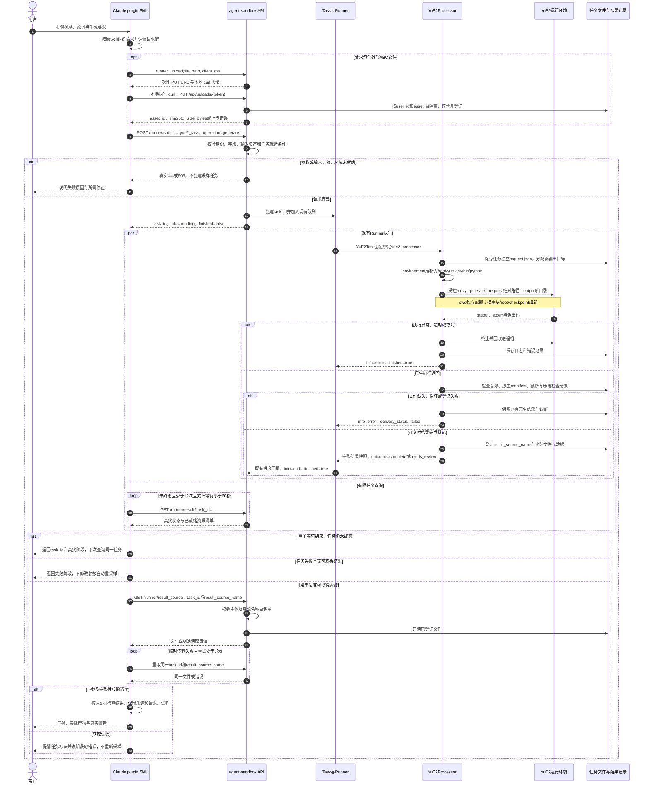
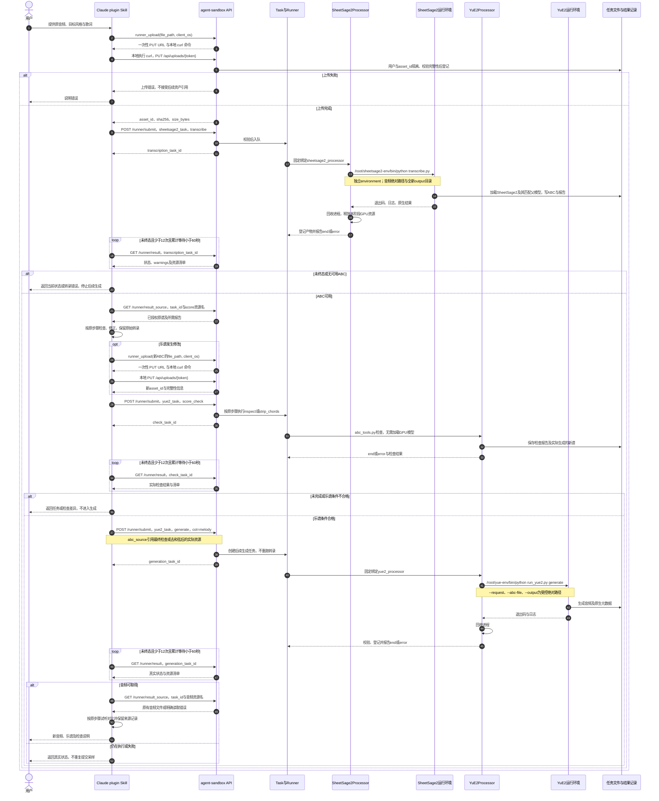
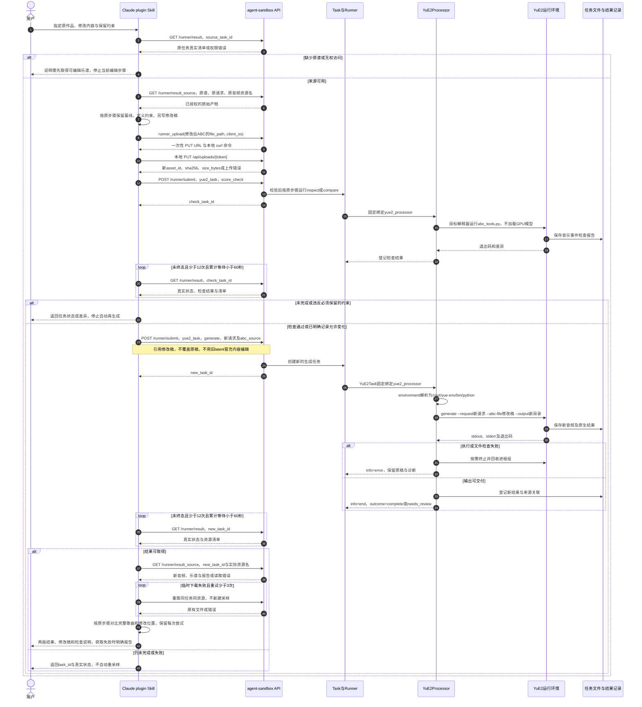
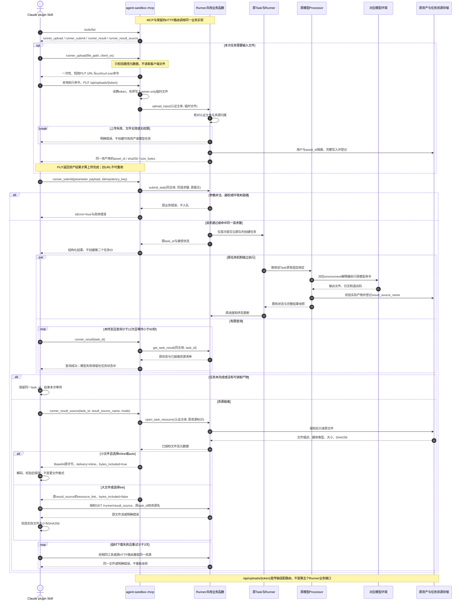

# 业务时序图

**版本：1.6｜范围：Claude plugin Skill 通过任务服务执行原业务步骤；上传采用云端签发、本地 PUT。**

原Skill步骤不变；调用方只保留Claude plugin Skill。Task/Processor与通用upload均为拟新增适配；查询和资源读取复用已有接口。本次提供Mermaid源码，不宣称已经通过渲染器验证。

## 普通生成

## 转录与翻唱

## 编辑与再生成

## Runner四接口MCP封装

四个工具是原Runner能力的另一协议入口；Task与模型环境不变。前三图保留HTTP业务步骤，第四图说明同一能力的MCP文件传输。

